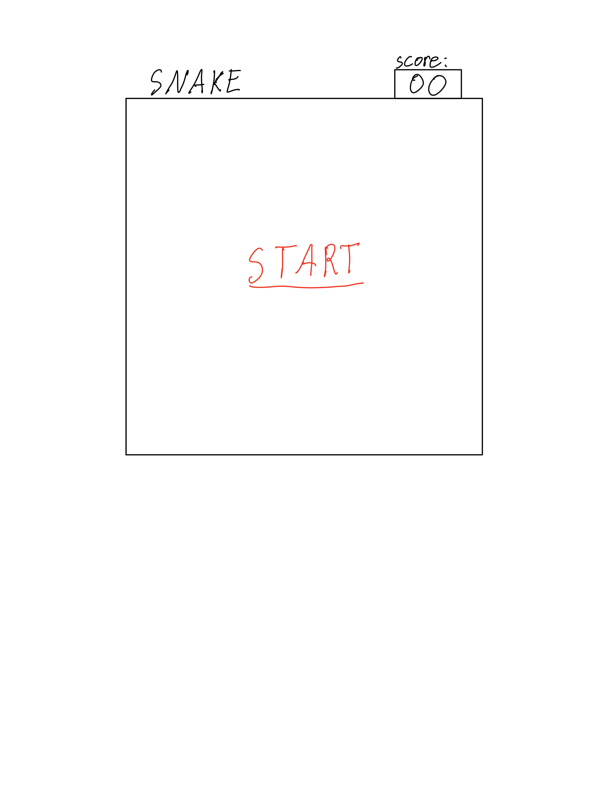
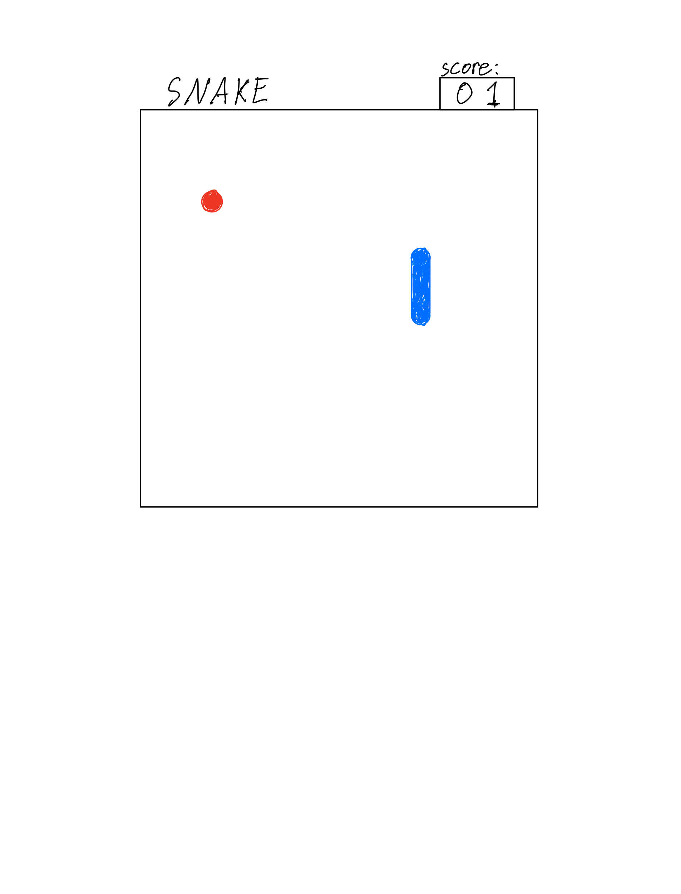
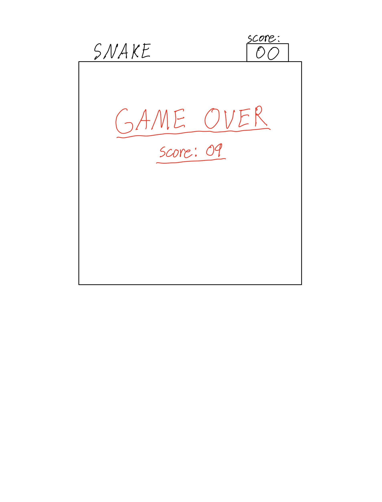
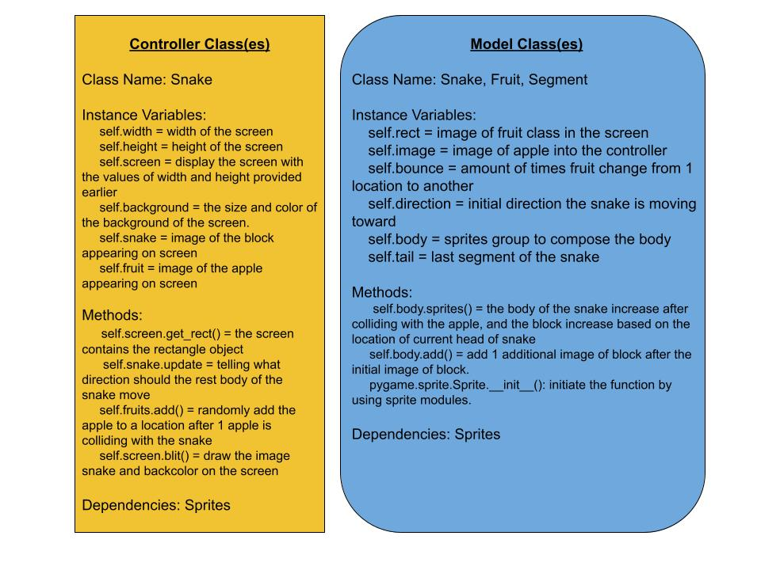

:warning: Everything between << >> needs to be replaced (remove << >> after replacing)
# CS110 Project Proposal
# Snake Game
## CS 110 Final Project
### Summer, 2021
### [Assignment Description](https://docs.google.com/document/d/1H4R6yLL7som1lglyXWZ04RvTp_RvRFCCBn6sqv-82ps/edit#)

[https://github.com/bucs110sum21/final-project-survivor](#)

[https://docs.google.com/presentation/d/1KDQIBTwZeMNkbeUd8UvRBJSprkywRxarJ_mL6eytX-c/edit?usp=sharing](#)

### Team: Survivor
#### Matt Murphy, Jiawei Liu

***

## Project Description *(Software Lead)*
Our game displays a block that moves around the screen and grows a segment of block after colliding with the apple. However, if the block collides against the wall or touches itself, then the game is over. The game resembles the classic snake game.  

***    

## User Interface Design *(Front End Specialist)*
* User interface concepts
* 
  * This is the start screen for our snake game, it contains the background of the game and a start button in the middle of the screen which when pressed will start the game.
* 
  * This is the screen the player will see when the game first starts, as the game progresses the user will eat more fruit and then their snake will grow.
* 
  * This is the screen the user will see when they lose or complete the game, the score will update to show their final score.  
* User interface final GUI
* 
  * description
* ![game over screen]
  * description

***        

## Program Design *(Backend Specialist)*
* Non-Standard libraries
    * Pygame
        * [https://www.pygame.org/docs/]
        * Pygame is a set of module which is designed for creating fully functioning video games and  multimedia in python.
    * Random
        * [https://docs.python.org/3/library/random.html]
        * Random is a module that adds pseudo-random number generators for various distributions.
        
* Class Interface Design
* 
  * this is the basic design of our video game classes

* Classes
    * << You should have a list of each of your classes with a description. >>

## Project Structure *(Software Lead)*

The Project is broken down into the following file structure:
* main.py
* src
    * controller.py 
    * fruit.py 
    * Snake.py 
* assets
    * apple.png
    * class_diagram.jpg
    * game_over_screen_drawing.png
    * game_screen_drawing.png
    * new_apple.png 
    * new_snake.png
    * snake.png 
    * snakebody.png
    * snakehead.png 
    * start_screen_drawing.png
    * program_design_drawings.jpg
* etc
    * demo.mp4

***

## Tasks and Responsibilities *(Software Lead)*
* You must outline the team member roles and who was responsible for each class/method, both individual and collaborative.

### Software Lead - Matt/Jiawei

<< Worked as integration specialist by... >>

### Front End Specialist - Matt

<< Front-end lead conducted significant research on... >>

### Back End Specialist - Jiawei

<< The back end specialist... >>

## Testing *(Software Lead)*
* << Describe your testing strategy for your project. >>
    * << Example >>

* Your ATP

| Step                  | Procedure     | Expected Results  | Actual Results |
| ----------------------|:-------------:| -----------------:| -------------- |
|  1  | Run Counter Program  | GUI window appears with count = 0  |          |
|  2  | click count button  | display changes to count = 1 |                 |
etc...
