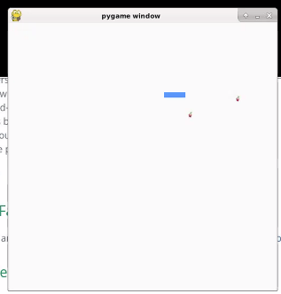
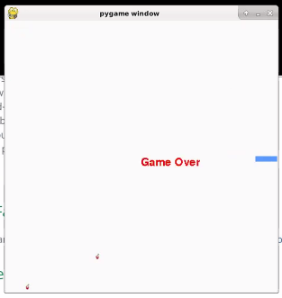

# CS110 Project Proposal
# Snake Game
## CS 110 Final Project
### Summer, 2021
### [Assignment Description](https://docs.google.com/document/d/1H4R6yLL7som1lglyXWZ04RvTp_RvRFCCBn6sqv-82ps/edit#)

[GitHub Repository link](https://github.com/bucs110sum21/final-project-survivor)

[Demo Slides link](https://docs.google.com/presentation/d/1KDQIBTwZeMNkbeUd8UvRBJSprkywRxarJ_mL6eytX-c/edit?usp=sharing)

### Team: Survivor
#### Matt Murphy, Jiawei Liu

***

## Project Description *(Software Lead: Matt/Jiawei)*
Our game displays a block that moves around the screen and grows a segment of block after colliding with the apple. However, if the block collides against the wall or touches itself, then the game is over. The game resembles the classic snake game.  

***    

## User Interface Design *(Front End Specialist: Matt)*
### User interface concepts
* 
  * This is the start screen for our snake game, it contains the background of the game and a start button in the middle of the screen which when pressed will start the game.
* 
  * This is the screen the player will see when the game first starts, as the game progresses the user will eat more fruit and then their snake will grow.
* 
  * This is the screen the user will see when they lose or complete the game, the score will update to show their final score.  
### User interface final GUI
* 
  * This is an image of our game in progress, as you can see the snake is the blue rectangle and there are two apples for the snake to try to eat.
* 
  * This is an image of the game over screen, in this instance the game ended because the snake collided with the wall.

***        

## Program Design *(Backend Specialist: Jiawei)*
* Non-Standard libraries
    * Pygame
        * [https://www.pygame.org/docs/]
        * Pygame is a set of module which is designed for creating fully functioning video games and  multimedia in python.
    * Random
        * [https://docs.python.org/3/library/random.html]
        * Random is a module that adds pseudo-random number generators for various distributions.
        
* Class Interface Design
* 
  * this is the basic design of our video game classes

* Classes
    * Fruit 
      * This class initializes the location and image of the fruit sprite, and has an update function which adds a new fruit to the screen.
    * Segment 
      * This class creates a new sprite segment whcih can be added on to the snake head.
    * Snake
      * This class initializes the location adn image for the snake sprite and has functions which can move the snake up, down, left, or right, and has a function which tests to see if the snake collides with itself, a function which adds a segment to the snake based on the direction its tail is facing, and a function whihc updates the snakes location to keep it constantly moving.
    * Controller 
      * This class utilizes the other classes to make the gaame run, it initializes the locations of the snakehead sprite and 3 initial segments for the body, it initializes the random locations of two fruit sprites, and has the main loop, game loop, and game over function for our game.  The main loop sets the game to run the game loop until the state is set to game over, which  it then runs the game over function.  The game loop moves the snake based on the users input, checks for collisions, and constanly updates the screen images and snake movements to keep the game running.  The game over function runs when the snake collides with the wall or itself, and the function ends the game and displays game over.  

## Project Structure *(Software Lead: Matt/Jiawei)*

The Project is broken down into the following file structure:
* main.py
* src
    * controller.py 
    * fruit.py 
    * Snake.py 
* assets
    * apple.png
    * class_diagram.jpg
    * game_over_screen_drawing.png
    * game_screen_drawing.png
    * new_apple.png 
    * new_snake.png
    * snake.png 
    * snakebody.png
    * snakehead.png 
    * start_screen_drawing.png
    * program_design_drawings.jpg
* etc
    * demo.mp4

***

## Tasks and Responsibilities *(Software Lead: Matt/Jiawei)*

### Software Lead - Matt/Jiawei

Worked as integration specialist by filling out the project proposal and ATP together and ensuring we both stayed on task while working. Overall we split the responsibilities of the software lead between each other since we didnt have a third team member.

### Front End Specialist - Matt

Front-end lead was responsible for the GUI and controller.py, and designing the user interface, and implementing the code to make this interface happen.

### Back End Specialist - Jiawei

The back end specialist wrote the data classes and class diagram and wrote most of the initial code in the project.

## Testing *(Software Lead: Matt/Jiawei)*
* We verified that our code works by first, making sure no traceback errors were being discovered. Then making sure every movement of the snake moved according to our expectations. To assure that our code worked as we made changes, we save the terminal everytime we finished one component of the code, to assure that part of the class runs perfectly fine.
    * An example of this is when we got the snake to show up on the screen we tested to see if the snake would move in each direction when we pressed the appropriate keystroke for that direction.  

***
## ATP

| Step | Procedure     | Expected Results  | Actual Results |
|:----------------------:|:-------------:|:-----------------:|:--------------:|
|  1  | Run program | GUI window appears and snake starts moving | GUI window appears and snake starts moving |
|  2  | Press down key | Snake starts moving down | Snake starts moving down |
|  3  | Press right key | Snake starts moving right | Snake starts moving right |
|  4  | Press up key | Snake starts moving up | Snake starts moving up |
|  5  | Press left key | Snake starts moving left | Snake starts moving left |
|  6  | Snake collides with fruit | Snake grows +1 segment, and new fruit appears | Snake grows +1 segment and new fruit appears |
|  7  | Snake collides with wall | Game over screen appears and game ends | Game over screen appears and game ends |
|  8  | Snake head collides with part of the snake body | Game over screen appears and game ends | Game over screen appears and game ends |
